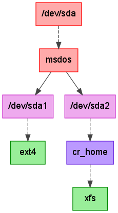
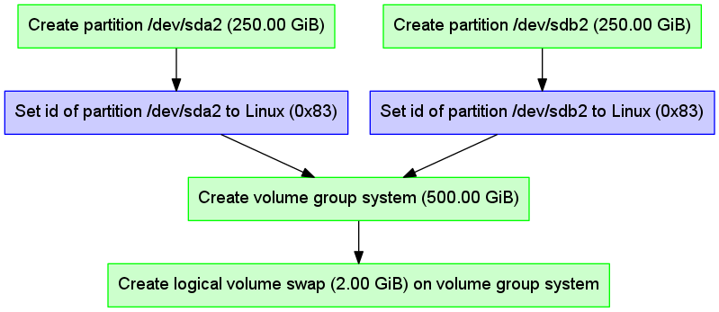
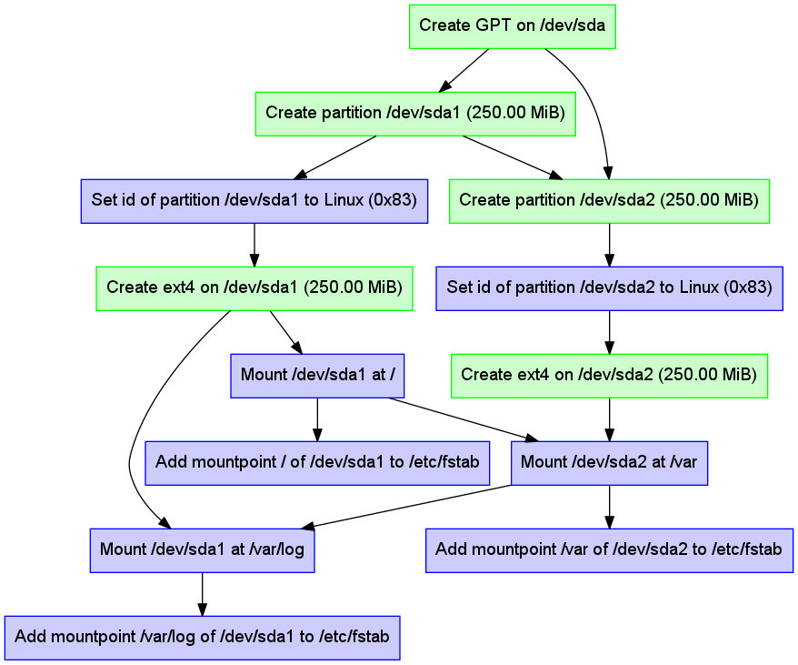

## Welcome to libstorage-ng

libstorage-ng is the designated successor of
[libstorage](https://github.com/openSUSE/libstorage), a C++ library used by
[YaST](https://github.com/yast) to perform most storage related tasks.

The main idea of libstorage-ng compared to libstorage is to keep all
information about storage devices in a
[graph](https://en.wikipedia.org/wiki/Graph_(discrete_mathematics)) instead of
lists. A second and even more interesting use-case for a graph are the actions
performed when committing the queued changes to the system.

### Device Graph

Storing the devices in libstorage as a graph looks like a natural
approach. Here is a simple graph showing a disk with a partition table, two
partitions and two filesystems where one is encrypted:

You might have seen the diagram above in YaST. But in libstorage-ng it is a
direct dump of internal data structure instead of a [cumbersome
transformation](https://github.com/openSUSE/libstorage/blob/master/storage/Graph.cc).

The graph approach has several advantages compared to the list of list design
of libstorage:

* No pseudo containers for e.g. MD RAID, tmpfs or NFS are needed.

* Possibility to have special objects for IMSM and DDF RAID containers.

* Some operations are trivial compared to the current libstorage, e.g. getting
  all devices using a device is just a plain
  [BFS](https://en.wikipedia.org/wiki/Breadth-first_search).

Together with the redesign of the device objects several features are now
simple, e.g. using unpartitioned disks for filesystems, renaming LVM volume
groups and logical volumes, switching between partitioned and unpartitioned MD
RAID.

### Action Graph

When committing the queued changes to the system libstorage-ng has to analyse
what steps are needed and in which order they must be done. Unfortunately the
code in libstorage has evolved and many if statements span several lines of
code.

The new approach of libstorage-ng looks different:

* Two device graphs (the first is the current system, the second the staging
  system) are compared and the required steps are stored as vertices of a
  graph. E.g. a step is to create a partition.

* Dependencies are added as edges to the graph. E.g. when creating two
  partitions on a disk the ordering is important (otherwise the partition
  numbers get swapped).

* A topological sort calculates the order in which the steps can be executed.

Here is a simply action graph for creating two partitions used by a volume
group with one logical volume.

Legend: The color indicates whether an action creates (green), modifies (blue)
or deletes (red) and object.

The new approach of libstorage-ng has several advantages:

* Better testability: The code to generate the actions and their dependencies
  can be checked in a testsuite. Only testing the actions themself needs to be
  done on an actual system.

* Checking the dependencies instead of the ordering is more robust. The
  ordering can be correct "by luck" while dependencies are explicit.

* The topological sort can also be used to find actions that can be done in
  parallel. This might be used for filesystem creation (although modern
  filesystems have fast mkfs commands).

Here is a more complex action graph with dependencies for partition creation
and mount ordering. One filesystem is mounted twice resulting in cross device
dependencies.

When you compile libstorage-ng you can find more action graphs in the
testsuite/dependencies directory.

### Testsuites

The library has several testsuites.

- Device graph: Checks basic manipulation of device graphs, e.g. adding or
  removing objects and copying graphs.

- Dependencies: Checks the action graph after comparing system and staging
  device graphs.

- SystemInfo: Checks parsers for external commands.

- Probe: Mocks external commands (SystemInfo) and checks that the probed
  device graph is correct.

- Utils: Checks utility functions, e.g. parsing sizes and udev encoding names.

- Python and Ruby Bindings: Since these are SWIG generated the scope is to
  test every concept, e.g. exceptions, runtime polymorphism and data types
  (input, output and ranges).

- Integration tests: Small Python scripts that test one or a few commit actions.
  Not run automatically yet.

### Status

Check the [status](status.md) of already implemented and still missing
functionality.

